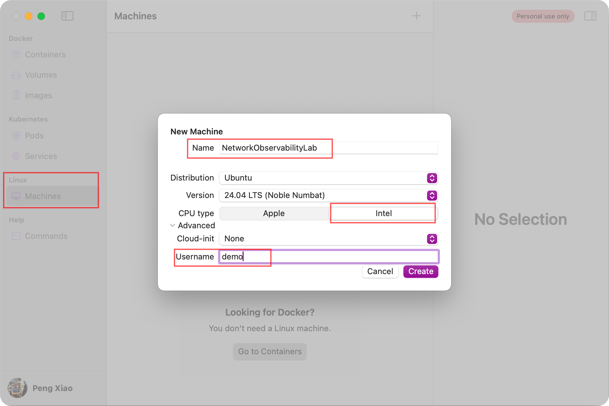
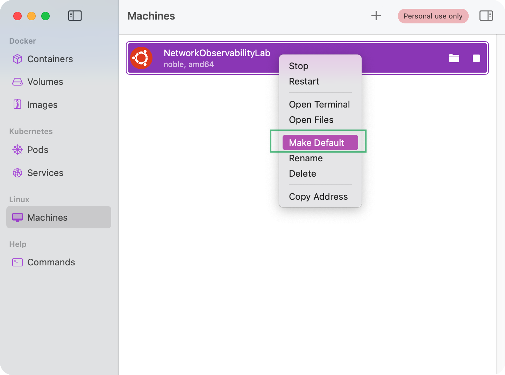
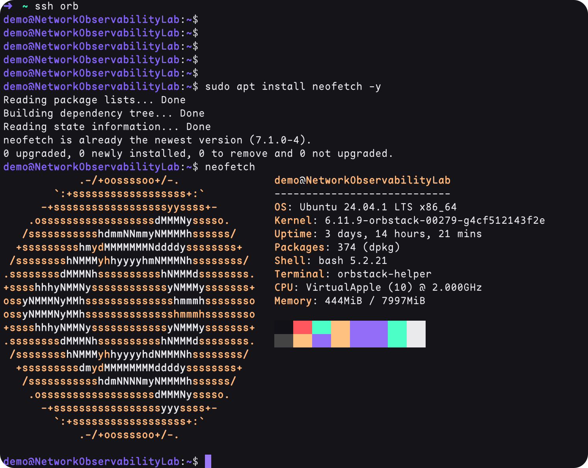

# Setup on Mac (M chips)

Install Orbstack on Mac [https://docs.orbstack.dev/quick-start](https://docs.orbstack.dev/quick-start)


## Create a Ubuntu 24.04 VM

!!! warning "Pay Attention"

    Please make sure choose **intel** based CPU




make the VM as default.




## SSH to the VM

Open your mac terminal, and execute


```sh
ssh orb
```

check the system by installing neofetch



## Install Docker

Using the script below to setup docker environment

```sh title="setup-docker.sh"
#/bin/sh

sudo apt-get -y update

# install some tools
sudo apt-get install -y git vim gcc build-essential telnet bridge-utils


curl -fsSL get.docker.com -o get-docker.sh

sh get-docker.sh

if [ ! $(getent group docker) ];
then
    sudo groupadd docker;
else
    echo "docker user group already exists"
fi

sudo gpasswd -a $USER docker
sudo service docker restart

rm -rf get-docker.sh
```


??? info "Check if Docker was installed successfully"

    check docker version/arch, make sure the Arch is `linux/amd64`

    ```sh
    demo@NetworkObservabilityLab:~$ docker version
    Client: Docker Engine - Community
    Version:           27.3.1
    API version:       1.47
    Go version:        go1.22.7
    Git commit:        ce12230
    Built:             Fri Sep 20 11:40:59 2024
    OS/Arch:           linux/amd64
    Context:           default

    Server: Docker Engine - Community
    Engine:
      Version:          27.3.1
      API version:      1.47 (minimum version 1.24)
      Go version:       go1.22.7
      Git commit:       41ca978
      Built:            Fri Sep 20 11:40:59 2024
      OS/Arch:          linux/amd64
      Experimental:     false
    containerd:
      Version:          1.7.23
      GitCommit:        57f17b0a6295a39009d861b89e3b3b87b005ca27
    runc:
      Version:          1.1.14
      GitCommit:        v1.1.14-0-g2c9f560
    docker-init:
      Version:          0.19.0
      GitCommit:        de40ad0
    demo@NetworkObservabilityLab:~$
    ```